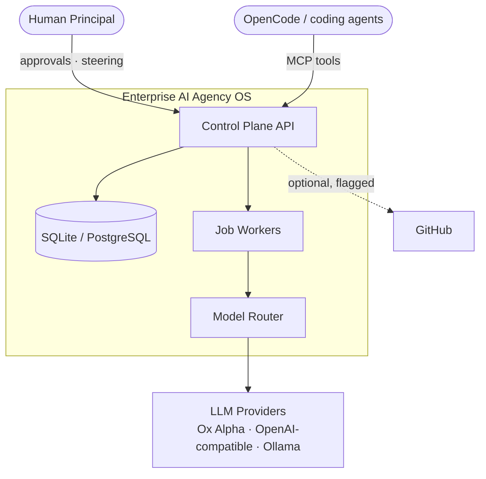
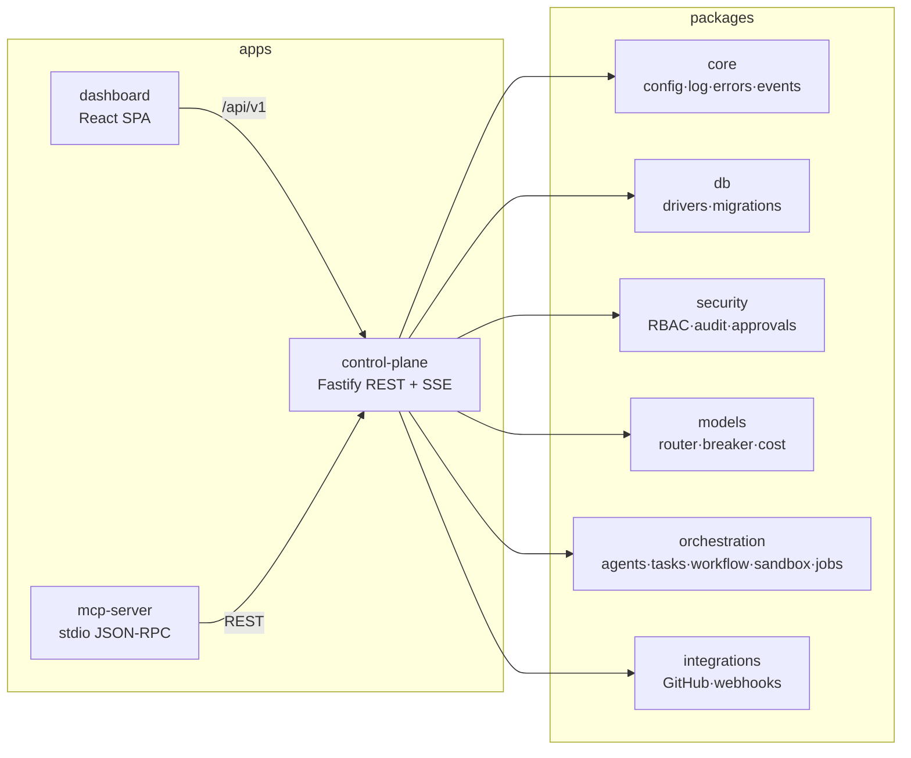

# ARCHITECTURE

## System context (C4 — L1)



## Containers (C4 — L2)



## Layered model (blueprint §3.1 → implementation)

| Blueprint layer | This repository |
|---|---|
| L0 runtime substrate | `SandboxProvider` (process/docker) + `ModelProvider` (mock/openai-compatible) |
| L1 orchestration & memory | domain event log, job queue with checkpoints, workflow runs, knowledge documents |
| L2 methodology | YAML-defined workflows encoding brainstorm→plan→execute→verify; agent system prompts encode TDD/review disciplines |
| L3 specialist agency | 21-agent registry (`AGENT_ROSTER`) with tool contracts |
| L4 governance control plane | Fastify API, RBAC, approvals, hash-chained audit, budgets, dashboard |

## Key flows

### Task dispatch (happy path)

```
POST /api/v1/executions {taskId, agentId}
  → execution row (queued) + audit event + AgentStarted domain event
  → job enqueued (idempotency key = exec:<id>)
worker:
  claims job (atomic UPDATE … WHERE status='pending')
  → marks running, agent busy
  → ModelRouter.complete(tier from agent contract)
      breaker.acquire → retry/backoff → fallback chain → cost estimate → budget guard
  → artifact persisted (implementation plan) + handoff knowledge doc
  → cost_events written at task/project/org/daily/monthly scopes
  → execution succeeded, AgentFinished event
```

### High-risk action gate

```
action requires approval?
  ├─ no  → permission check only
  └─ yes → assertApproved(action, resourceType, resourceId)
             ├─ approved decision exists and unexpired → proceed
             └─ otherwise → 202 APPROVAL_REQUIRED
                            human decides on dashboard/API
```

### Session resilience

- Workflow engine checkpoints `completedStages` after every stage.
- Job queue: at-least-once delivery, exponential backoff, dead-letter table.
- Domain events are append-only; SSE replays the recent buffer on connect.

## Trust boundaries

1. **API edge** — bearer key auth, RBAC per route, rate limiting, structured errors.
2. **Sandbox** — agents never run arbitrary host commands; process provider is dev-only,
   docker provider (network=none, read-only fs, cpu/mem/pids caps) for production.
3. **Model providers** — keys resolved via env-backed secret refs; prompts are redacted;
   external content is DATA, never INSTRUCTIONS.
4. **Webhooks** — inbound: signature+timestamp verification planned via integration adapters;
   outbound: HMAC-signed with timestamp, bounded retries.

## Data model

35 tables in schema v1 — see `packages/db/src/migrations/0001_init.sql`.
Ownership: every material row carries `org_id`; mutable aggregates carry an
optimistic-locking `version`. Audit rows form a hash chain (`prev_hash`→`hash`).
